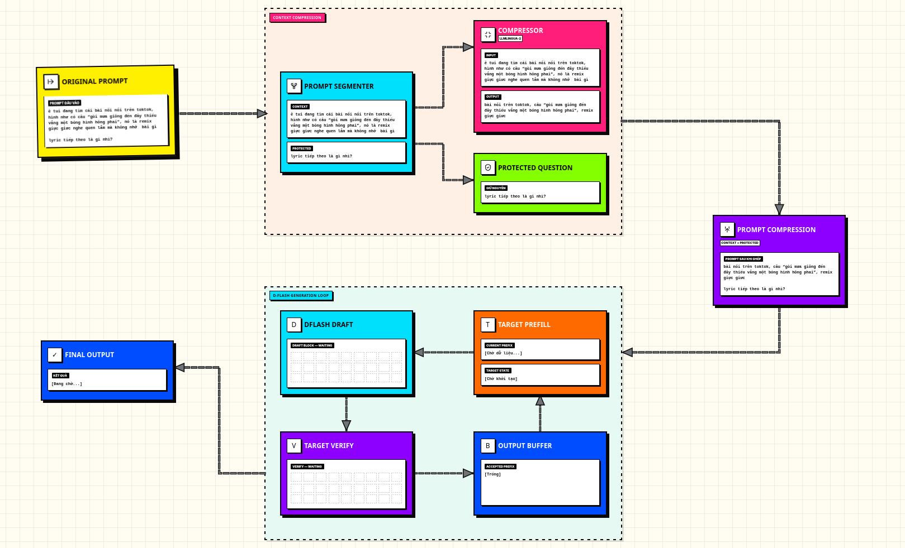

# CC-DFlash

**Context-Compressed DFlash** là project nghiên cứu kết hợp **prompt/context compression** với **DFlash speculative decoding** nhằm giảm lượng token đầu vào và tăng tốc quá trình sinh văn bản trên GPU phổ thông.

Project sử dụng:

- **Target model:** Qwen3-4B-AWQ
- **Draft model:** Qwen3-4B-DFlash-b16
- **Compressor:** LLMLingua-2 XLM-RoBERTa Large MeetingBank
- **Backend:** PyTorch + Hugging Face Transformers
- **Demo:** FastAPI + Vite/React
- **Phần cứng kiểm thử:** NVIDIA GeForce RTX 4070 Laptop GPU, khoảng 8 GB VRAM

> Final benchmark đã hoàn tất với `n=20` trên GSM8K và QMSum. Kết quả cho thấy DFlash tăng tốc decode rõ rệt, nhưng CC-DFlash chưa tạo lợi ích end-to-end do compression overhead và chưa giữ được chất lượng trên GSM8K short prompts.

---

## 1. Kiến trúc

<p align="center">
  
</p>

| Kiến trúc | Input | Decoding |
|---|---|---|
| Baseline-AR | Prompt gốc | Autoregressive |
| DFlash | Prompt gốc | Draft + Verify |
| CC-DFlash | Prompt đã nén | Draft + Verify |

Trong benchmark nghiên cứu, project dùng đủ bốn điều kiện:

| ID | Điều kiện | Compression | Decoding |
|---|---|---|---|
| C1 | Baseline-AR | Không | Autoregressive |
| C2 | DFlash-R1 | Không | DFlash |
| C3 | LLMLingua-AR-R2 | Có | Autoregressive |
| C4 | CC-DFlash-R2 | Có | DFlash |

C3 được giữ lại để tách riêng ảnh hưởng của compression khỏi ảnh hưởng của DFlash.

---

## 2. Điểm nổi bật

- Runtime DFlash độc lập cho target model AWQ.
- Four-condition benchmark với raw JSONL, manifest, checksum và audit.
- Prompt compression bằng LLMLingua-2 trên CPU hoặc CUDA.
- Fact safeguard cho short mathematical prompts.
- Query-aware context selection cho QMSum long context.
- Compression cache dùng chung giữa C3 và C4.
- Resume/checkpoint theo từng condition.
- Live demo chạy prompt bất kỳ.
- Streaming token thật từ generation loop qua Server-Sent Events.
- Metric live tách riêng generation latency, compression latency và pipeline E2E.

---

## 3. Kết quả final benchmark n=20

### 3.1 Chất lượng

| Dataset | C1 Baseline-AR | C2 DFlash-R1 | C3 LLMLingua-AR-R2 | C4 CC-DFlash-R2 |
|---|---:|---:|---:|---:|
| GSM8K Numeric EM | **18/20** | **18/20** | **15/20** | **15/20** |
| QMSum ROUGE-L F1 | 0.1914 | **0.1984** | 0.1933 | 0.1922 |

Diễn giải:

- DFlash giữ cùng Numeric EM với Baseline-AR trên GSM8K.
- Compression làm GSM8K giảm từ `18/20` xuống `15/20`.
- QMSum giữ lexical-overlap proxy gần baseline.
- ROUGE-L chỉ đo mức trùng khớp chuỗi từ với reference; điểm gần nhau không chứng minh semantic correctness.

### 3.2 Decode throughput

Đơn vị: `tok/s`, chỉ tính generation path và không bao gồm compression overhead.

| Dataset | C1 | C2 | C3 | C4 |
|---|---:|---:|---:|---:|
| GSM8K | 31.98 | **114.64** | 31.64 | 110.45 |
| QMSum | 22.74 | **41.60** | 23.86 | 40.90 |

DFlash đạt khoảng:

- **3.58×** throughput của Baseline-AR trên GSM8K.
- **1.83×** throughput của Baseline-AR trên QMSum.

### 3.3 Input-token reduction

#### GSM8K

```text
96.25 → 94.05 tokens/sample
Giảm 2.20 tokens/sample
Reduction: 2.27%
```

Short prompts chứa ít phần dư nên LLMLingua-2 chỉ giảm rất ít token.

#### QMSum

```text
Full transcript:           11,675.65 tokens/sample
Query-selected context:       932.35 tokens/sample
Final effective context:      846.80 tokens/sample
```

Tính từ hai mean token counts đầu–cuối:

```text
11,675.65 → 846.80 tokens/sample
Giữ lại: 7.25%
Loại khỏi final input: 92.75%
```

Phần lớn mức giảm đến từ **query-aware context selection**. LLMLingua-2 chỉ nén thêm context đã được chọn:

```text
932.35 → 846.80 tokens/sample
Giảm thêm khoảng 9.18%
```

Không nên diễn giải rằng LLMLingua-2 tự nén toàn bộ transcript xuống 846.80 token.

### 3.4 Pipeline E2E latency

| Dataset | DFlash-R1 | CC-DFlash-R2 | Delta |
|---|---:|---:|---:|
| GSM8K | 1126.05 ms | 1176.28 ms | **+4.46% chậm hơn** |
| QMSum | 2012.81 ms | 2843.05 ms | **+41.25% chậm hơn** |

Chi tiết CC-DFlash:

| Dataset | Compression | Generation | Pipeline E2E |
|---|---:|---:|---:|
| GSM8K | 87.16 ms | 1089.12 ms | 1176.28 ms |
| QMSum | 619.75 ms | 2223.29 ms | 2843.05 ms |

Kết luận: decode có thể nhanh, nhưng lợi ích generation chưa đủ bù compression overhead trong cấu hình final.

---

## 4. Trạng thái kết quả

```text
FINAL_BENCHMARK_COMPLETE
```

Các kết luận được hỗ trợ:

- DFlash tăng decode throughput so với autoregressive decoding.
- DFlash giảm generation latency trên cùng target model.
- Query-aware selection giảm mạnh long-context input.
- QMSum lexical overlap gần baseline trong protocol hiện tại.

Các kết luận không được khẳng định:

- CC-DFlash nhanh hơn DFlash end-to-end.
- GSM8K quality được bảo toàn sau compression.
- LLMLingua-2 tạo ra toàn bộ mức giảm context trên QMSum.
- QMSum semantic correctness được bảo toàn.
- Dataset exact-token parity luôn đạt tuyệt đối.

---

## 5. Yêu cầu hệ thống

### Phần cứng tham chiếu

- NVIDIA GPU hỗ trợ CUDA.
- Khoảng 8 GB VRAM cho cấu hình đã kiểm thử.
- RAM đủ để tải target, draft và compressor theo policy hiện tại.

### Phần mềm

- Linux hoặc WSL2.
- Python `3.10–3.12`.
- Conda được khuyến nghị.
- CUDA-compatible PyTorch.
- Node.js cho frontend Vite.

Môi trường final đã kiểm thử với:

```text
Python       3.12.x
PyTorch      2.9.1 + CUDA 12.6
Transformers 4.57.3
GPU          RTX 4070 Laptop GPU
```

---

## 6. Cấu trúc thư mục

```text
CCDF-Rework/
├── config.yml
├── pyproject.toml
├── requirements.txt
├── README.md
├── instruction.md
│
├── src/ccdf/
│   ├── api/                    # FastAPI live-demo backend
│   ├── benchmark/
│   │   └── four_condition/     # C1–C4 runner, manifest và audit
│   ├── compression/            # LLMLingua-2 và safeguard
│   ├── datasets/               # GSM8K/QMSum prompt pipeline
│   ├── dflash/                 # Draft, verify và acceptance
│   ├── evaluation/             # Dataset evaluators
│   ├── frontend/               # Vite + React frontend
│   └── runtime/                # Model/runtime engine
│
├── scripts/
│   ├── run_four_condition.py
│   ├── run_demo_backend.sh
│   └── run_demo_frontend.sh
│
├── tests/
├── data/eval/
├── docs/
│   ├── CC-DFlash-Overview.html
│   ├── Roadmap.html
│   ├── final-benchmark-n20/
│   └── reviews/
│
└── models/
    ├── baseline/
    ├── dflash/
    └── compressor/
```

`models/`, caches, local environments và `.worktrees/` không nên được commit lên Git.

---

## 7. Cài đặt

### 7.1 Tạo môi trường Conda

```bash
conda create -n CCDF python=3.12 -y
conda activate CCDF
```

### 7.2 Cài PyTorch CUDA

Cài bản PyTorch phù hợp với driver/CUDA của máy trước. Không nên để `pip` tự thay bản CUDA đã hoạt động ổn định.

Kiểm tra:

```bash
python - <<'PY'
import torch

print("torch:", torch.__version__)
print("cuda runtime:", torch.version.cuda)
print("cuda available:", torch.cuda.is_available())

if torch.cuda.is_available():
    print("device:", torch.cuda.get_device_name(0))
PY
```

### 7.3 Cài dependencies

Cách đơn giản:

```bash
python -m pip install -r requirements.txt
```

Hoặc cài editable theo nhóm:

```bash
python -m pip install -e ".[awq,demo,dev,data,profile]"
```

Kiểm tra package:

```bash
python -c "import ccdf; print('CCDF import: PASS')"
```

> AutoAWQ trong môi trường final sử dụng compatibility patch cho Transformers 4.57.3. Không tự ý nâng Transformers mà chưa chạy lại model-loading tests.

---

## 8. Chuẩn bị model

### Tải model từ Hugging Face

Cài hoặc cập nhật Hugging Face CLI:

```bash
python -m pip install -U huggingface_hub
```

### Tải các mô hình cần thiết:

```bash
mkdir -p \
  models/baseline \
  models/dflash \
  models/compressor

hf download Qwen/Qwen3-4B-AWQ \
  --local-dir models/baseline/Qwen3-4B-AWQ

hf download z-lab/Qwen3-4B-DFlash-b16 \
  --local-dir models/dflash/Qwen3-4B-DFlash-b16

hf download microsoft/llmlingua-2-xlm-roberta-large-meetingbank \
  --local-dir models/compressor/llmlingua-2-xlm-roberta-large-meetingbank
```

Các đường dẫn mặc định được quản lý trong `config.yml`. Cấu trúc tham chiếu:

```text
models/
├── baseline/
│   └── Qwen3-4B-AWQ/
├── dflash/
│   └── Qwen3-4B-DFlash-b16/
└── compressor/
    └── llmlingua-2-xlm-roberta-large-meetingbank/
```

Model weights không được phân phối trong repository.

Trước khi chạy benchmark, kiểm tra:

- model path tồn tại;
- tokenizer/config tương thích;
- CUDA khả dụng;
- target model load bằng AWQ;
- compressor chạy đúng CPU/CUDA theo config.

---

## 9. Live demo

Live demo nhận **prompt bất kỳ** và chạy tuần tự:

```text
Baseline-AR → DFlash → Compression → CC-DFlash → Compare
```

Output được stream từ model loop thật:

- Baseline-AR stream token ngay sau khi target commit.
- DFlash/CC-DFlash chỉ stream token đã accepted hoặc correction token sau verify.
- Không stream draft proposal chưa được xác minh.
- Không giả lập streaming bằng timer.

### 9.1 Chạy backend

```bash
conda activate CCDF
python -m src.ccdf.api
```

Hoặc:

```bash
uvicorn src.ccdf.api.app:app \
  --host 127.0.0.1 \
  --port 8000 \
  --reload
```

### 9.2 Chạy frontend

Dùng package manager tương ứng với lockfile hiện tại:

```bash
cd src/ccdf/frontend
npm install
npm run dev
```

Vite proxy `/api` tới backend tại `http://127.0.0.1:8000`.

